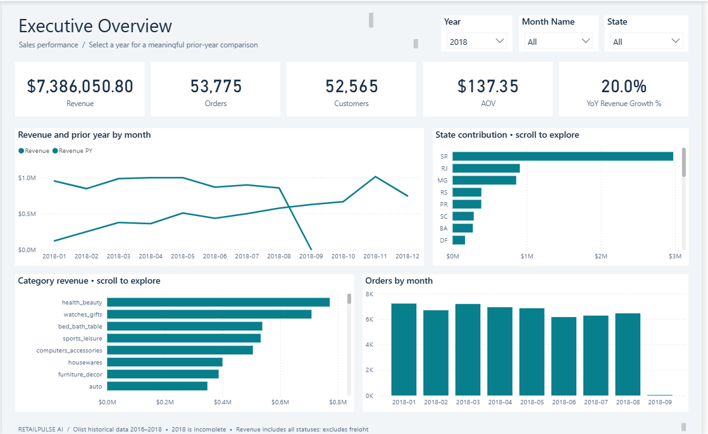
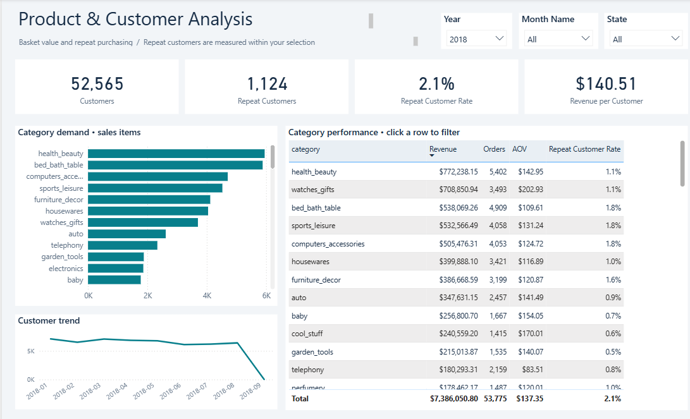
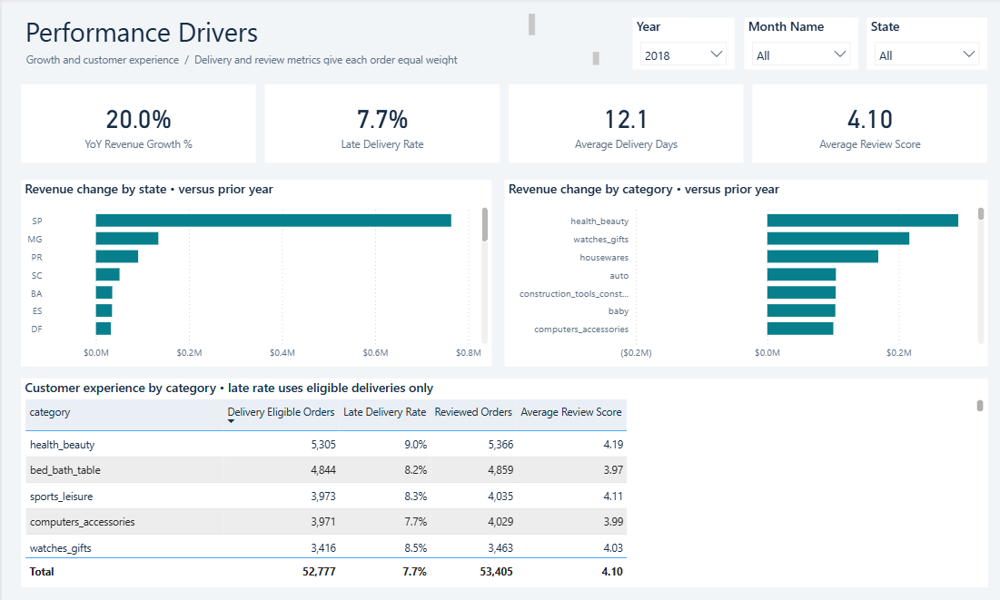

# RetailPulse AI — Sales Intelligence

A portfolio project combining Power BI analytics, independent KPI validation and a free, local executive-summary template.

## Business question

How can an e-commerce manager turn sales and customer-experience metrics into a concise management brief without manually copying figures or inventing explanations?

## Project status

- Three Power BI pages: Executive Overview, Product & Customer Analysis, Performance Drivers.
- Twenty-two DAX measures; 220 comparisons against the source CSVs passed.
- Forty-nine dashboard definition files passed schema validation. All three report pages were visually reviewed from Power BI Desktop screenshots.
- Free offline summary available; no API key, credits or paid service required.
- Paid AI narration was skipped by choice. The included summary is a template, not AI-generated analysis.

## Open the dashboard

Open `powerbi/RetailPulse.pbip` and keep the sibling report and semantic-model folders together. The original `frjkt.pbix` contains the earlier KPI-only report. Local Power Query sources currently use this workstation's absolute paths; update those paths when moving the project.

## Dashboard preview

### Executive Overview



### Product & Customer Analysis



### Performance Drivers



## Data and definitions

The project uses the [Brazilian E-Commerce Public Dataset by Olist](https://www.kaggle.com/datasets/olistbr/brazilian-ecommerce), covering historical orders from 2016–2018. The sales fact has 112,650 unique order-item rows and 98,666 orders with items. Raw CSV files are excluded from this repository; see [data setup](data/README.md).

Revenue sums merchandise prices across all statuses and excludes freight. Customer identity uses the persistent unique customer ID. Delivery measures count orders once; review scores average per order before averaging across orders. The data does not establish profit, margin, refunds or causality. The report explicitly notes that 2018 is incomplete.

## Workflow

```text
Olist CSVs → Power Query / model → DAX measures → Power BI report
                                        ↓
                       Independent CSV validation
                                        ↓
                    Aggregate KPI export → Python
                                        ↓
             Local offline summary template
                                        ↓
                  Executive brief + evidence + provenance
```

## Free summary

```powershell
python src/generate_insights.py --preview
python -m unittest discover -s src -p test_generate_insights.py -v
```

Double-click `Run AI Brief.cmd` to generate the free summary locally. See [the offline summary](outputs/sample_brief_preview.md) and [summary documentation](documentation/ai-narrator.md). The narrator uses only aggregate facts and rejects unknown fact references and literal numeric claims. Human review is still necessary for interpretation and causal language.

## Documentation

- [Portfolio case study and demonstration](documentation/portfolio-case-study.md)

- [Measure audit](documentation/measure-audit.md)
- [Project progress and KPI definitions](documentation/project-continuation.md)
- [Dashboard pages and verification](documentation/dashboard-pages.md)
- [Narrator setup and limitations](documentation/ai-narrator.md)

## AI-assisted development

An AI assistant helped implement the model checks, dashboard definitions, narration workflow and documentation. Numerical checks were run against source data; the user reported completing the manual dashboard check. Paid API narration is excluded from the current project scope and has not produced a successful brief. No claim of autonomous production deployment is made.
